# 📊 TechnoHub Electronics and Gadgets Shop — SQL Data Analysis Case Study

## 🏢 Company Overview
**TechnoHub** specializes in selling smartphones, laptops, and audio devices, with a strong online presence. The aim of this project was to enhance customer experience, increase revenue, and improve inventory management using data-driven insights.

---

## 🎯 Business Goals
- Increase revenue through customer spending insights.
- Improve customer retention with targeted strategies.
- Optimize inventory by tracking product sales.
- Assess discount effectiveness.

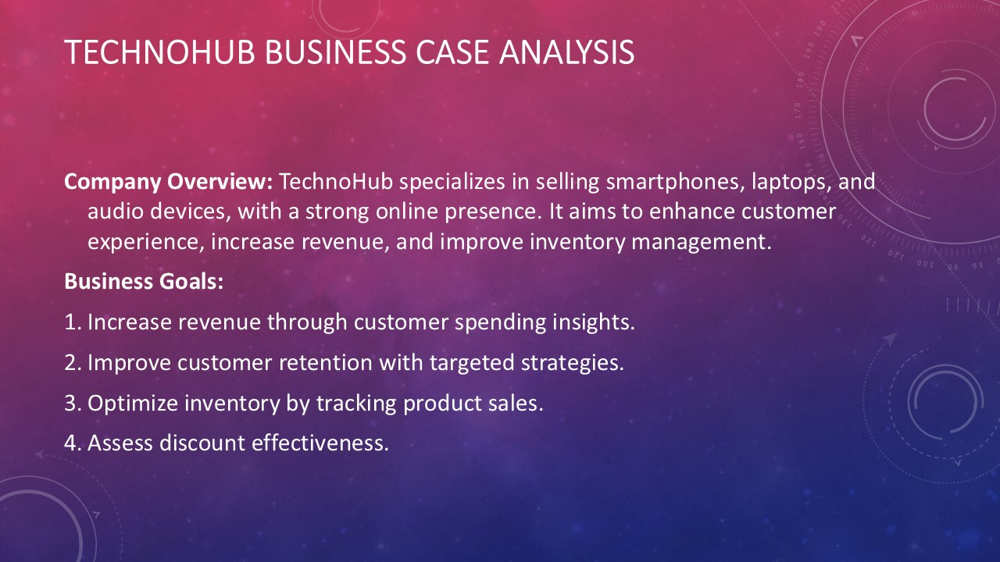

---

## 📂 Dataset Overview
This project uses a structured dataset containing three tables:
- **customers** (Dimension Table)
- **products** (Dimension Table)
- **factsales** (Fact Table)

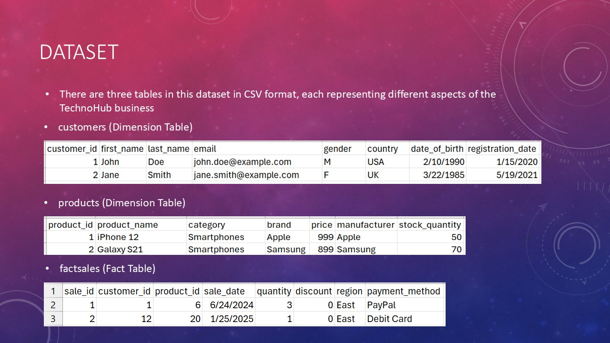

---

## 🛠️ Techniques Used
- SQL Queries (MySQL)
- Common Table Expressions (CTEs)
- Window Functions (`ROW_NUMBER()`, `SUM() OVER()`, `LAG()`)
- Aggregations and Grouping
- Date Parsing and Formatting (`STR_TO_DATE`, `DATE_FORMAT`)
- Case Statements for segmentation

---

# 📈 Key Analysis and Insights

## 1. Customer Spending Analysis
Identifying high-value customers based on their total spending.

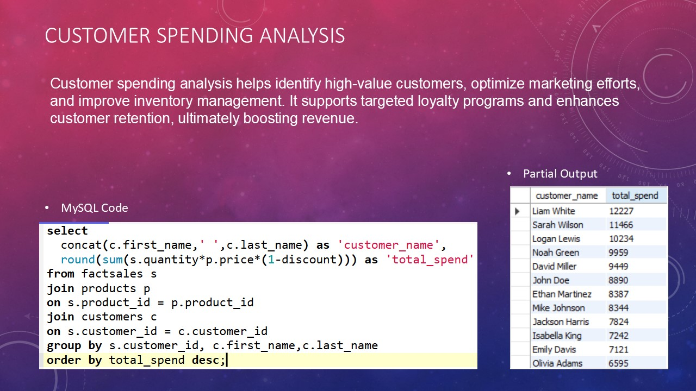

---

## 2. Customer's Highest Single Purchase
Analyzing each customer's highest individual transaction amount.

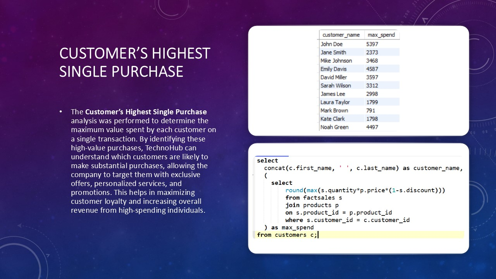

---

## 3. Customer Segmentation Using Sales Tier
Grouping customers into High, Medium-High, Medium-Low, and Low spenders.

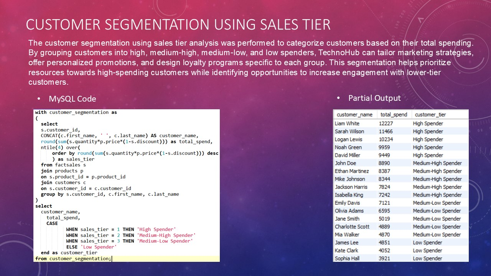

---

## 4. Customer Retention
Tracking customers who made purchases across 5+ months.

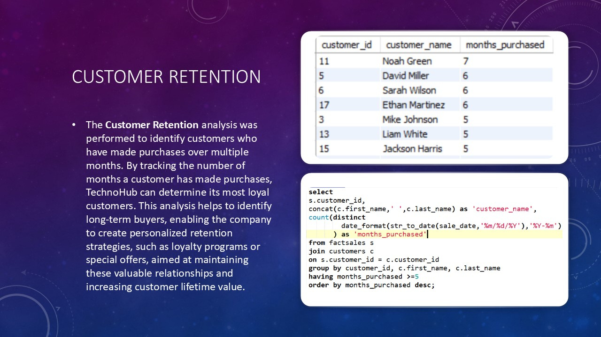

---

## 5. Comparison Between Current and Previous Month's Sales
Understanding month-over-month performance changes.

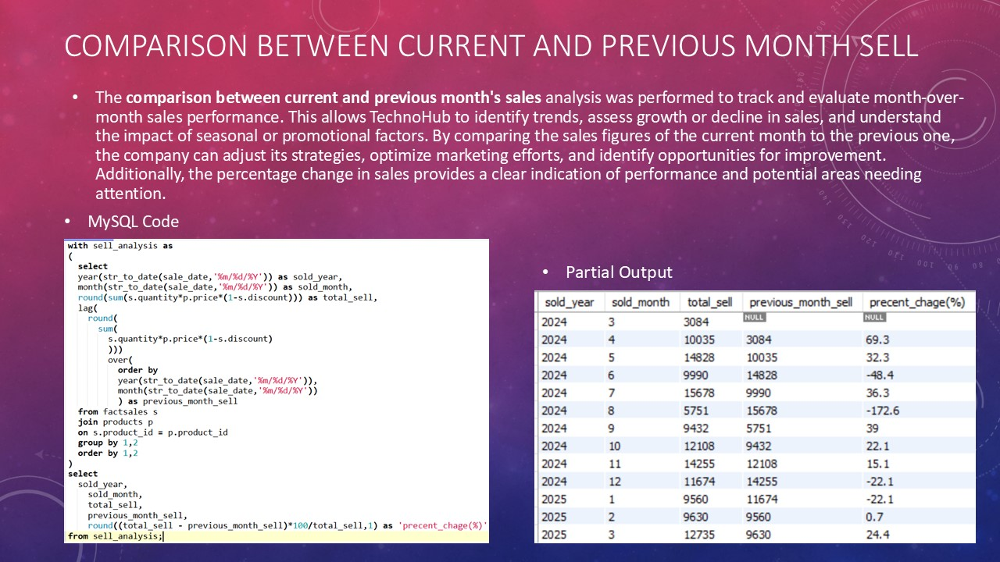

---

## 6. Rolling Sales of Latest Transaction and Past 2 Months' Transactions
Monitoring rolling sales over a 3-month window to track customer spending behavior.

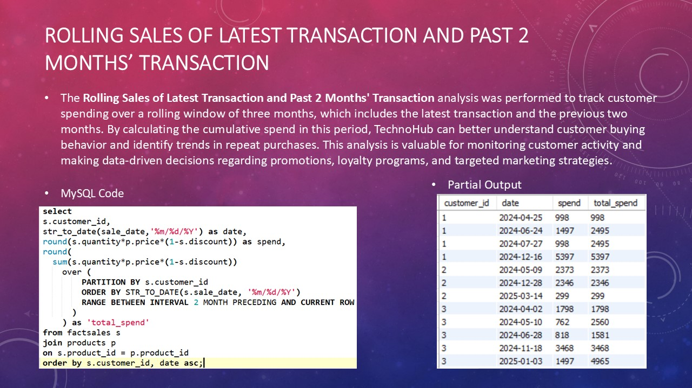

---

## 7. Monthly Sale by Product Category
Analyzing product performance over different months to identify seasonality trends.

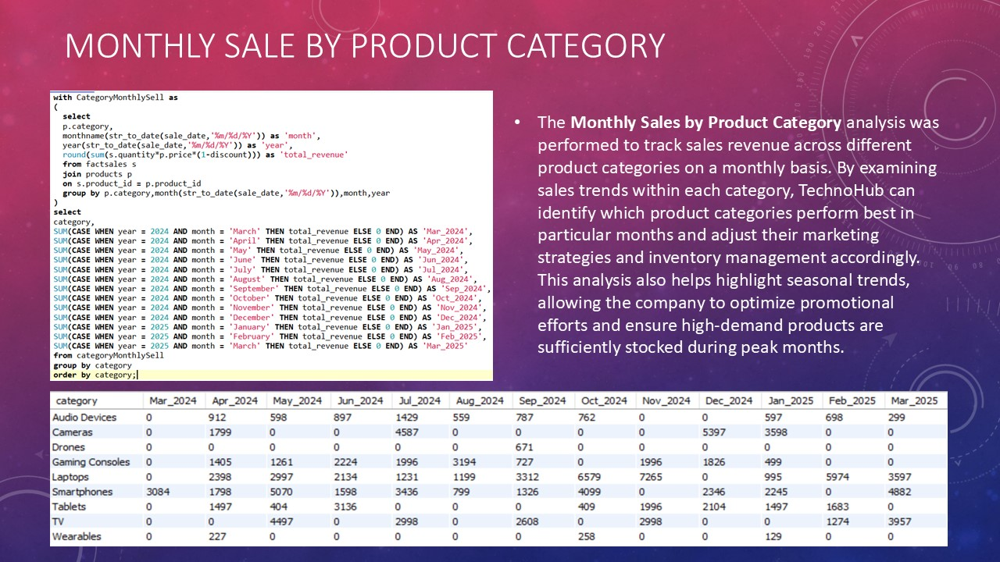

---

## 8. Top Selling Product by Revenue
Finding the highest revenue-generating products for inventory and marketing focus.

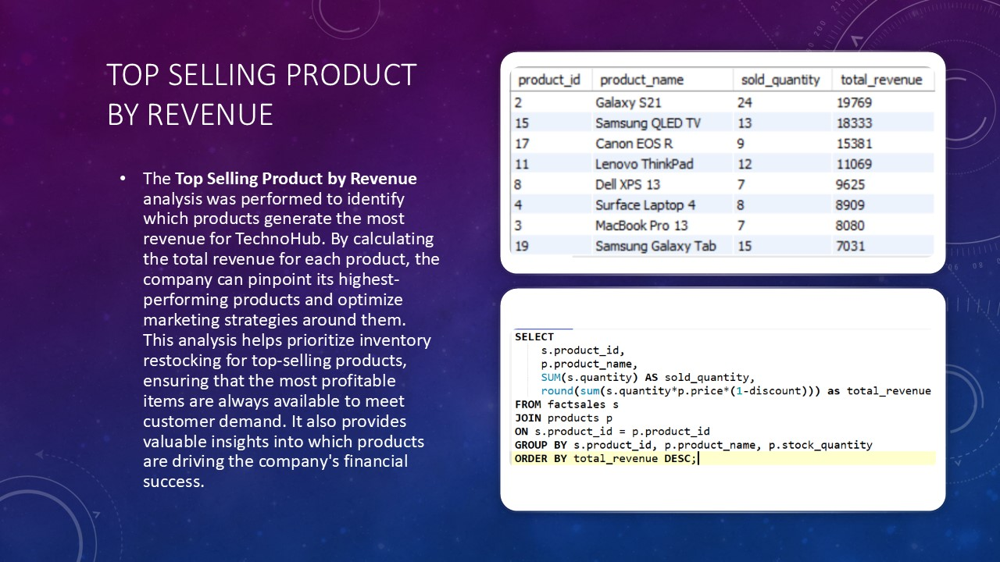

---

## 9. Product Sold and Remaining Stock
Monitoring sold quantity and identifying products needing restocking.

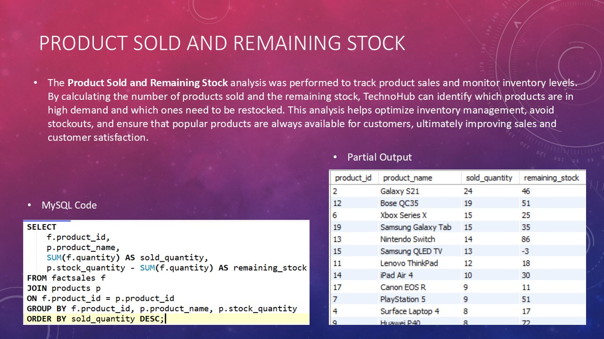

---

## 10. Discount Effectiveness
Measuring how discounts impact sales volume and revenue.

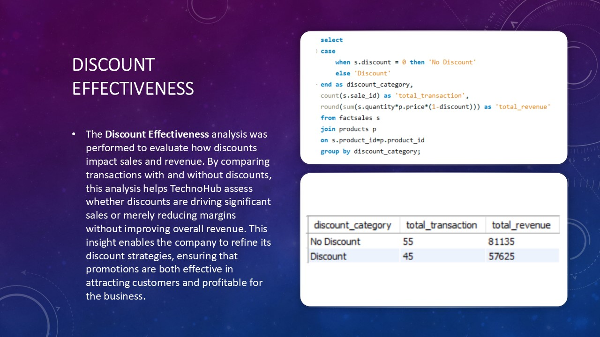

---

## 11. Payment Method Distribution
Analyzing popular payment methods to optimize transaction experiences.

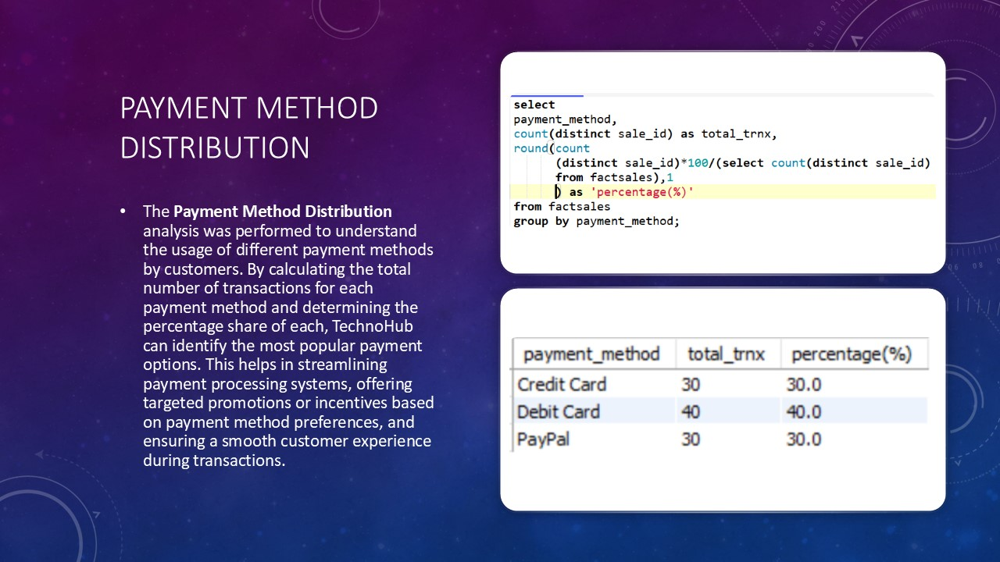

---

# 🏁 Conclusion

This project provided meaningful insights into customer behavior, sales trends, inventory optimization, and promotional effectiveness at TechnoHub.  
Through structured SQL analysis and advanced techniques like window functions and CTEs, I was able to build a strong foundation for real-world business decision-making.

---

# 🚀 Connect with Me
Feel free to reach out if you have any questions or would like to collaborate on similar data projects!

**Tanvir Taushif**  
[LinkedIn](https://www.linkedin.com/in/tanvir-taushif-751044204/)

---
